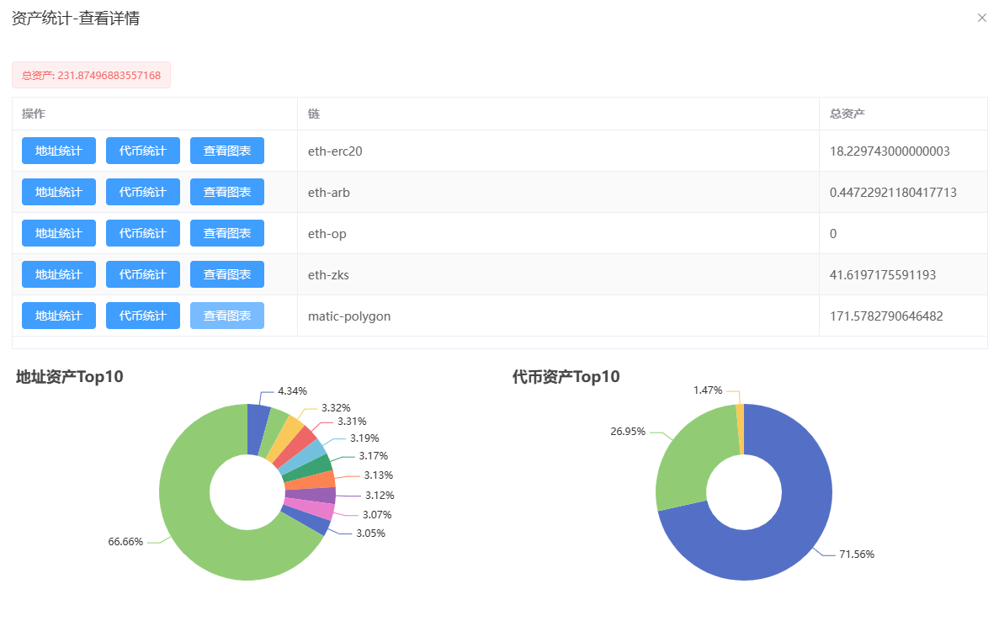

# 创建并运行第一个任务

打开任务管理，点击新增任务

<figure><figcaption></figcaption></figure>

根据图下的内容填充，然后点击选择身份

<figure><figcaption></figcaption></figure>

根据你的需要，选择勾选合适的身份，点击确定

<figure><figcaption></figcaption></figure>

<figure><figcaption></figcaption></figure>

新的流程就出现在了列表里

<figure><figcaption></figcaption></figure>

点击运行列表，可以查看当前流程的所有子任务

<figure><figcaption></figcaption></figure>

点击日志列表，可以查看每个子任务在运行过程中的日志

<figure><figcaption></figcaption></figure>

切换到客户端，可以看到任务被领取并且执行完毕，图中的敏感信息为客户端本地打印，实际环境敏感信息打印默认是关闭的。

<figure><figcaption></figcaption></figure>

子任务在运行过程中的日志在日志列表中也能及时看到

<figure><figcaption></figcaption></figure>

默认业务状态0是成功的状态，非0的时候，根据各类脚本输出的信息可以判断问题

<figure><figcaption></figcaption></figure>

当一个流程中所有子任务都运行完毕后，流程会结束

<figure><figcaption></figcaption></figure>
